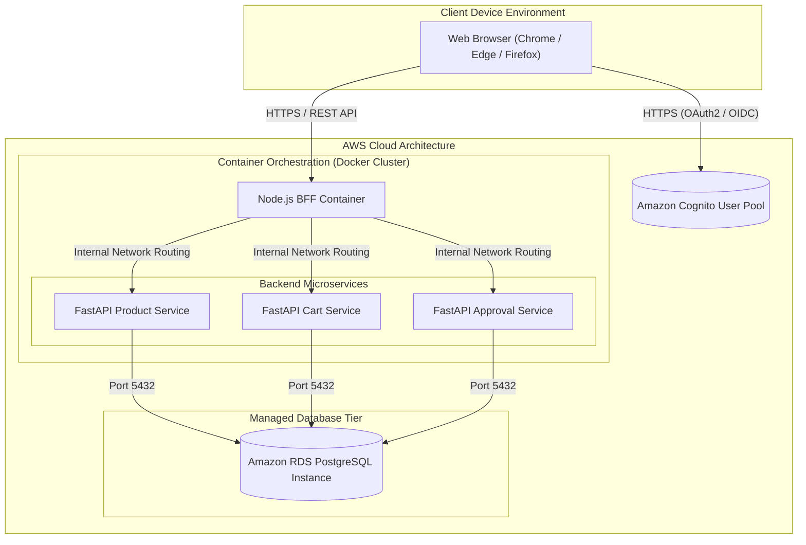

# FreshMarket - Deployment Diagram

```mermaid
flowchart TD
    subgraph Client ["Client Device Environment"]
        Browser["Web Browser (Chrome / Edge / Firefox)"]
    end

    subgraph AWS ["AWS Cloud Architecture"]
        direction TB

        Cognito[("Amazon Cognito User Pool")]

        subgraph ECS ["Container Orchestration (Docker Cluster)"]
            direction LR
            BFF_Container["Node.js BFF Container"]

            subgraph Services ["Backend Microservices"]
                direction TB
                Prod_Container["FastAPI Product Service"]
                Cart_Container["FastAPI Cart Service"]
                Appr_Container["FastAPI Approval Service"]
            end
        end

        subgraph ManagedDB ["Managed Database Tier"]
            RDS[("Amazon RDS PostgreSQL Instance")]
        end
    end

    %% Edge Connections
    Browser -- "HTTPS (OAuth2 / OIDC)" --> Cognito
    Browser -- "HTTPS / REST API" --> BFF_Container

    %% Internal Container Network
    BFF_Container -- "Internal Network Routing" --> Prod_Container
    BFF_Container -- "Internal Network Routing" --> Cart_Container
    BFF_Container -- "Internal Network Routing" --> Appr_Container

    %% Database Connections
    Prod_Container -- "Port 5432" --> RDS
    Cart_Container -- "Port 5432" --> RDS
    Appr_Container -- "Port 5432" --> RDS
```
