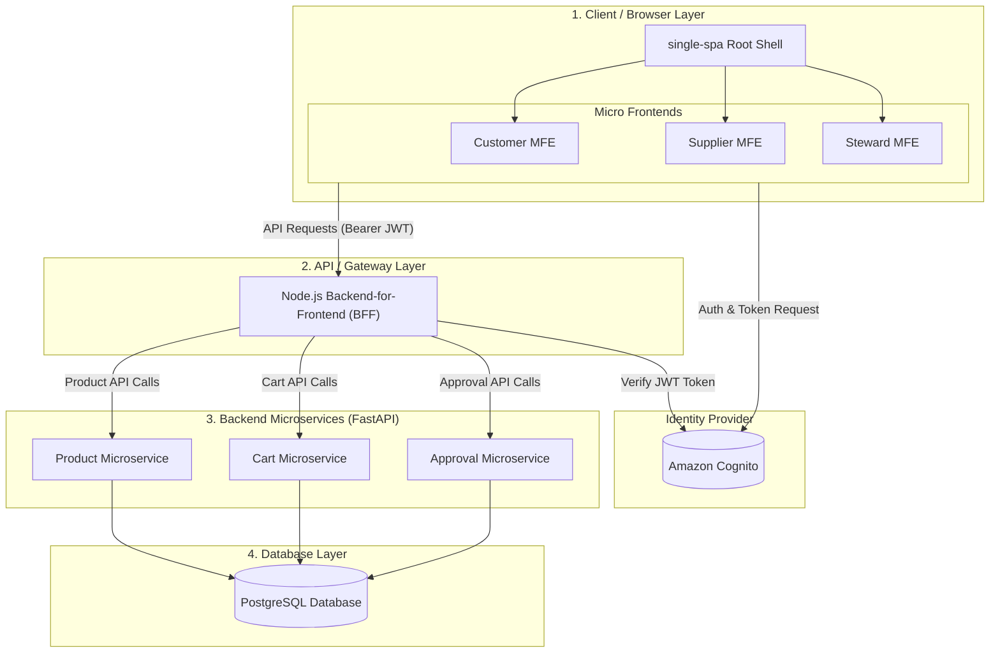

# FreshMarket - Logical Architecture Diagram

```mermaid
flowchart TD
    subgraph Client ["1. Client / Browser Layer"]
        Shell["single-spa Root Shell"]

        subgraph MFEs ["Micro Frontends"]
            MFE1["Customer MFE"]
            MFE2["Supplier MFE"]
            MFE3["Steward MFE"]
        end

        Shell --> MFE1 & MFE2 & MFE3
    end

    subgraph Auth ["Identity Provider"]
        Cognito[("Amazon Cognito")]
    end

    subgraph Gateway ["2. API / Gateway Layer"]
        BFF["Node.js Backend-for-Frontend (BFF)"]
    end

    subgraph Microservices ["3. Backend Microservices (FastAPI)"]
        ProdSVC["Product Microservice"]
        CartSVC["Cart Microservice"]
        ApprSVC["Approval Microservice"]
    end

    subgraph Storage ["4. Database Layer"]
        DB[("PostgreSQL Database")]
    end

    %% Clean Flow Connections
    MFEs -- "Auth & Token Request" --> Cognito
    MFEs -- "API Requests (Bearer JWT)" --> BFF

    BFF -- "Verify JWT Token" --> Cognito

    BFF -- "Product API Calls" --> ProdSVC
    BFF -- "Cart API Calls" --> CartSVC
    BFF -- "Approval API Calls" --> ApprSVC

    ProdSVC --> DB
    CartSVC --> DB
    ApprSVC --> DB
```
