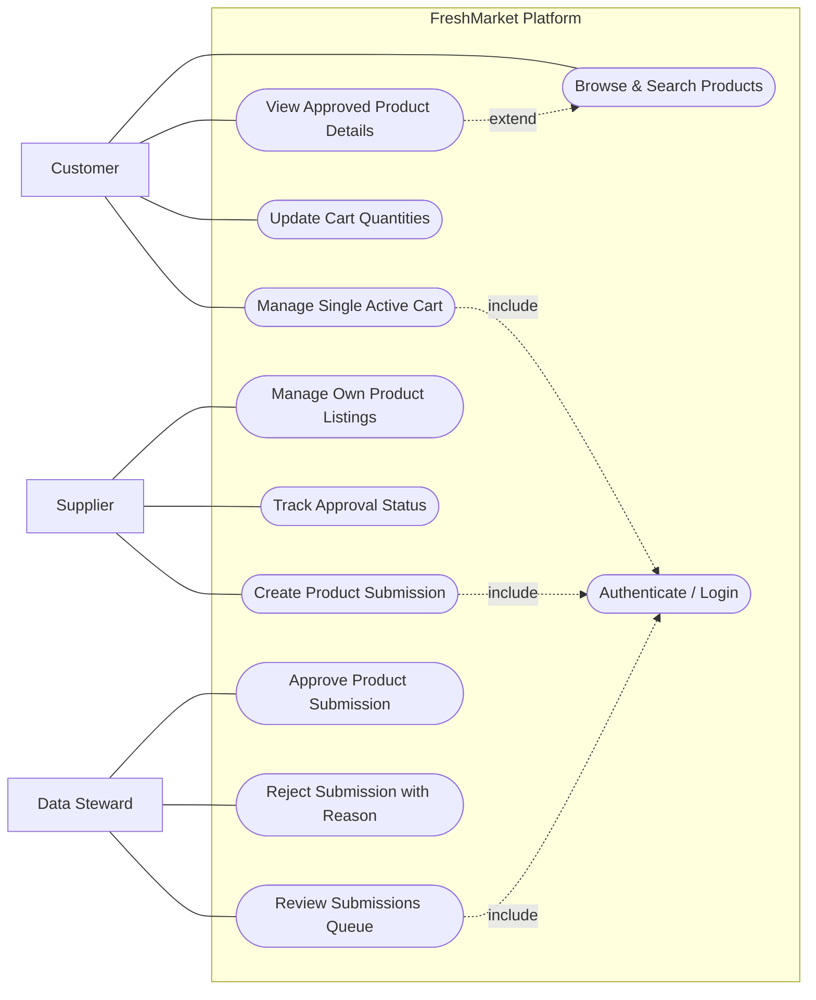

# FreshMarket - Enterprise Food Marketplace Use Case Diagram

```mermaid
graph LR
    %% Actors (Outside system boundary)
    Customer[Customer]
    Supplier[Supplier]
    Steward[Data Steward]

    %% Main System Boundary
    subgraph FreshMarket Platform
        direction TB

        %% Use Cases rendered as Ovals/Stadiums
        UC1([Browse & Search Products])
        UC2([View Approved Product Details])
        UC3([Manage Single Active Cart])
        UC4([Update Cart Quantities])

        UC5([Create Product Submission])
        UC6([Manage Own Product Listings])
        UC7([Track Approval Status])

        UC8([Review Submissions Queue])
        UC9([Approve Product Submission])
        UC10([Reject Submission with Reason])

        UC_Auth([Authenticate / Login])
    end

    %% Customer Lines
    Customer --- UC1
    Customer --- UC2
    Customer --- UC3
    Customer --- UC4

    %% Supplier Lines
    Supplier --- UC5
    Supplier --- UC6
    Supplier --- UC7

    %% Steward Lines
    Steward --- UC8
    Steward --- UC9
    Steward --- UC10

    %% Include / Extend relationships
    UC3 -. "include" .-> UC_Auth
    UC5 -. "include" .-> UC_Auth
    UC8 -. "include" .-> UC_Auth
    UC2 -. "extend" .-> UC1
```
